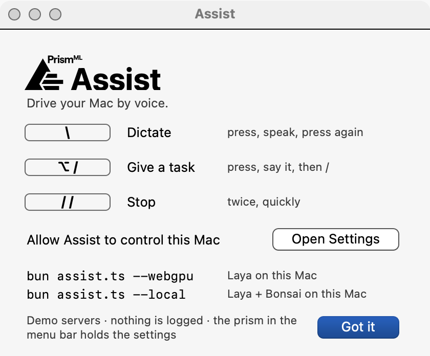

# Assist

Computer use for your Mac, by voice. Two models share the work:

- **Laya** (0.4B) is a JEPA-like computer-use model. It doesn't generate text: it reads the screen and picks the next click, scroll or menu item in about 15 ms on a GPU.
- **Bonsai 27B** does what Laya can't generate: it writes, types, answers, and takes the harder steps.

Assist reads the window in front of you as text through macOS's accessibility API, so it needs no screenshots. It speaks its answers, so you don't have to watch it work. It's a single file with no dependencies, and all you need is [Bun](https://bun.sh). (`bonsaiengine.ts`, next to it, is only needed to run Bonsai on your Mac.)

```sh
bun assist.ts
```

The first time, this installs Assist in `~/Applications` and opens it. After that, it just opens it. A prism appears in the menu bar, and this guide opens:

<p align="center"></p>

macOS asks you to let Assist control your Mac: turn it on under System Settings › Privacy & Security › Accessibility (**Open Settings** takes you there). The guide is always under **Help** in the prism's menu.

| Key | What it does |
|---|---|
| `\` | **Dictate.** Press, speak, press again: your words are typed where the cursor is. |
| `⌥ /` | **Give a task.** Press, say it ("reply to Anna's last email: I'll be there at 3"), then press `/` to run it. |
| `/` | **Cut in.** While Assist works or talks, press `/`, say something new, and press `/` again. |
| `/ /` | **Stop everything.** Press twice, quickly. |

Before Assist sends, posts or deletes anything, it asks you out loud. To answer, press `/`, say yes or no, and press `/` again.

## Private by default

- **No logging.** Assist keeps no transcripts and no history. It deletes each recording and each spoken sentence as soon as it has been used, and writes only crash reports. The demo servers keep nothing either. If you want a log on your Mac, turn on Goals › Keep a log on this Mac, or run with `--logs`.
- **What leaves your Mac:** your task, your recording (to be transcribed), and each step's screen as text, meaning the names of the controls and the visible text of the window in front. What you type in password fields, and the contents of terminal windows, are left out. Screenshots are sent only if you turn on Model › Send screenshots.
- **The demo servers are the default,** so there's nothing to set up. They run at bonsai.stream:
  - Laya picks the clicks.
  - Bonsai 27B writes and answers.
  - Whisper transcribes what you say.

## Use your own servers

Any OpenAI-compatible server works. Set it in the menu (Model ›, Dictation ›) or with flags:

```sh
bun assist.ts --api https://your-server/v1 --key <key> --model <name>
bun assist.ts --whisper https://your-whisper/v1     # /audio/transcriptions, or whisper.cpp's /inference
bun assist.ts --layaApi https://your-laya/v1
```

Settings you change in the menu are saved, and they take priority over the flags. Reset settings, in the menu, clears them.

## Run it locally

```sh
bun assist.ts --webgpu    # Laya on this Mac
bun assist.ts --local     # Laya and Bonsai on this Mac
```

- **Laya on your GPU:** `--webgpu`, or turn on Model › Run Laya on this Mac. Assist asks before it downloads Laya (610 MB from Hugging Face).
- **Bonsai on your GPU too:** `--local` (both models), or turn on Model › Run Bonsai on this Mac (Laya has its own switch). Assist asks before it downloads Bonsai 27B (5.9 GB from Hugging Face) and, if you turn on Model › Send screenshots, its picture part (0.6 GB). The app reads each question out loud: Return downloads, Escape says not now.
  - It needs a Mac with 16 GB of memory or more, room on the disk for the download, and `bonsaiengine.ts` in the same folder as `assist.ts`. When something is missing, Assist says what, and the main model stays on the server.
  - The first start compiles the engine and tunes it for your GPU, so it is slower than later ones.
- Both run with WebGPU in a small window of Chrome, Chromium, Edge or Brave, so you need one of them installed. Every download is checked by SHA-256.
- Once both run on your Mac, the screen never leaves it. Until then (before you agree to a download, or on a Mac that can't run Bonsai), the main model stays on the server, and Assist tells you. Your recordings still go to the Whisper server to be transcribed: point `--whisper` at your own to keep them at home too.

## The app

- Assist runs the `assist.ts` you started it from, with the flags you gave. If you move the file or change the flags, quit Assist from its menu and run `bun assist.ts` again.
- It asks once for its own Accessibility and microphone permissions.
- `bun assist.ts --noapp` runs Assist in the terminal instead, with the terminal's permissions.
- `bun assist.ts --app` installs or updates the app without opening it.
- If an earlier Assist app starts the same `assist.ts`, Assist names it: quit it and remove it, so only one app answers the keys.

## If something doesn't work

- **`\` types a backslash:** Assist doesn't have Accessibility yet (with `--noapp`, it's your terminal that needs it).
  - Turn it on, then restart Assist.
  - If it's already on and still doesn't work, remove the entry with −, start Assist again, and allow it.
- **Dictation hears nothing:** allow the microphone under Privacy & Security › Microphone.
- **Another app uses the same keys:** change them under Dictation › Dictation key and Task key.
- **To find the cause:** `bun assist.ts --check` tests the permissions and the servers. Crash reports go to `~/Library/Application Support/com.prismml.assist.mac/tray.err` (with `--noapp`, to the terminal).

## Uninstall

Quit Assist from its menu, then run:

```sh
rm -rf ~/Applications/Assist.app "$HOME/Library/Application Support/com.prismml.assist.mac"
defaults delete com.prismml.assist.mac
```

## More

- `--tui` gives you a text interface in the terminal.
- `--task "…"` runs a single task.
- `--help` lists every flag.
- Assist needs macOS 14 or later and Bun 1.4 or later.

Apache-2.0. Laya's WebGPU engine and `bonsaiengine.ts`, Bonsai's, are by the bonsai-webgpu contributors. The Laya model is [convaiinnovations/laya](https://huggingface.co/convaiinnovations/laya) (Apache-2.0), and Bonsai 27B is [prism-ml/Ternary-Bonsai-2-27B-gguf](https://huggingface.co/prism-ml/Ternary-Bonsai-2-27B-gguf).
